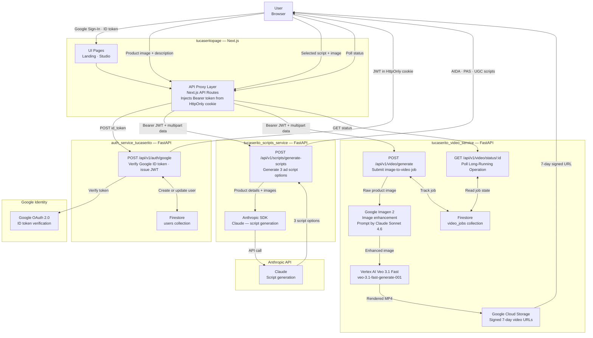

# Tu Caserito — Platform Overview

Tu Caserito is an AI-powered video ad generator built for small and medium businesses in Bolivia. Business owners upload a single product image and a short description, and the platform automatically produces a professional video advertisement — no video editing skills, design knowledge, or technical expertise required.

The platform is composed of four independent microservices that communicate over HTTPS. The Next.js frontend acts as both the user interface and a secure API proxy layer, routing all authenticated requests through server-side API routes to keep credentials out of the browser. Script generation is handled by a dedicated service powered by the Anthropic Claude API. Video rendering runs on Google's Vertex AI infrastructure, with an image enhancement step using Google Imagen 2 before each video is generated. User identity is managed through a standalone authentication service backed by Google OAuth 2.0 and Firestore.

---

## System Architecture

---

## User Flow

1. The user opens Tu Caserito and clicks **Sign in with Google**. The browser's Google Identity Services library issues an ID token, which the frontend sends to the Auth Service for verification. On success, a platform JWT is stored in an HttpOnly cookie — invisible to JavaScript.

2. The user uploads a product image and types a product name and short description. Optionally, they choose a video style, music genre, and aspect ratio.

3. The frontend sends the image and product details to the Scripts Service. Claude generates three distinct ad script options, each following a different copywriting strategy: AIDA, PAS, or UGC. Each option includes a narration text, a visual direction prompt for Veo, and an audio direction prompt.

4. The user reviews the three script options and selects one.

5. The frontend sends the selected script and product image to the Video Service. The raw product image is first enhanced by Google Imagen 2 (using an enhancement prompt generated by Claude Sonnet 4.6), then the enhanced image and Veo prompts are submitted to Vertex AI Veo 3.1 Fast to render an 8-second video. The service returns a `video_id` immediately while rendering continues asynchronously.

6. The frontend polls the status endpoint every few seconds until the job transitions to `COMPLETED`. The Video Service retrieves the rendered MP4 from Google Cloud Storage, generates a 7-day signed URL, and returns it to the frontend.

7. The user watches the finished video ad directly in the browser and can download it for use in their marketing channels.

---

## Services

| Service | Description | Repository |
|---|---|---|
| Frontend | Next.js application serving the user interface and acting as a secure API proxy that injects authentication tokens from server-side HttpOnly cookies before forwarding requests to backend services | https://github.com/cesarveraa/tucaseritopage |
| Auth Service | FastAPI service that verifies Google ID tokens, manages user records in Firestore, and issues platform-internal JWTs shared across all microservices | https://github.com/ChristianMendozaa/auth_service_tucaserito |
| Scripts Service | FastAPI service that calls the Anthropic Claude API to generate three video ad script options — AIDA, PAS, and UGC — each including narration text and Veo-ready visual and audio prompts | https://github.com/ChristianMendozaa/tucaserito_scripts_service |
| Video Service | FastAPI service that enhances the product image via Google Imagen 2, submits a long-running video generation job to Vertex AI Veo 3.1 Fast, stores the result in Google Cloud Storage, and returns a signed URL to the caller | https://github.com/ChristianMendozaa/tucaserito_video_service |

---

## Tech Stack

| Category | Technology |
|---|---|
| **Frontend** | Next.js 16.1.6 · React 19.2.4 · TypeScript |
| **Frontend** | Google Identity Services (browser-side OAuth Sign-In) |
| **Frontend** | HttpOnly cookies · security headers · CORS proxy pattern |
| **Backend** | FastAPI · Uvicorn · Python 3.11 |
| **Backend** | Pydantic · python-dotenv · SlowAPI (rate limiting) |
| **Backend** | python-jose (JWT signing and verification) |
| **AI Models** | Anthropic Claude (script generation via Anthropic SDK) |
| **AI Models** | Google Imagen 2 via Vertex AI (product image enhancement) |
| **AI Models** | Google Veo 3.1 Fast via Vertex AI — `veo-3.1-fast-generate-001` (video generation) |
| **Infrastructure** | Google Cloud Firestore (user records and video job tracking) |
| **Infrastructure** | Google Cloud Storage (rendered video storage and signed URL delivery) |
| **Infrastructure** | Google Cloud Platform — Vertex AI · service accounts · IAM |
| **Infrastructure** | Vercel (serverless deployment for all four services) |

---

## Team

- **Christian Mendoza** — AI Engineer & Backend — Auth Service, Scripts Service, Video Service
- **César Vera** — Frontend Engineer — tucaseritopage
